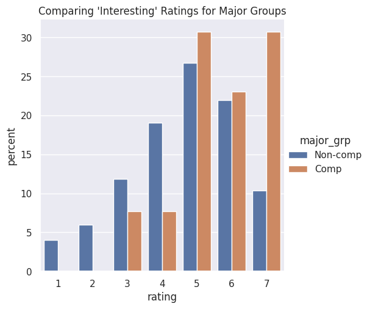
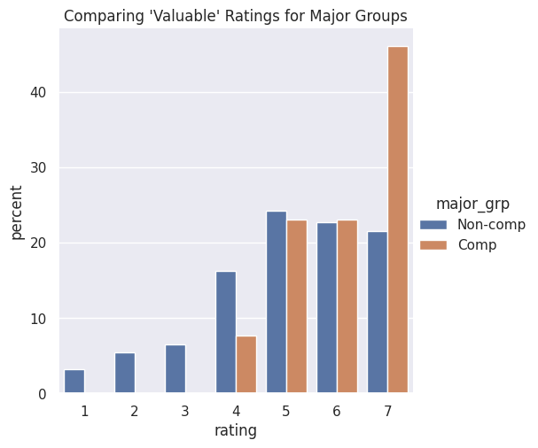
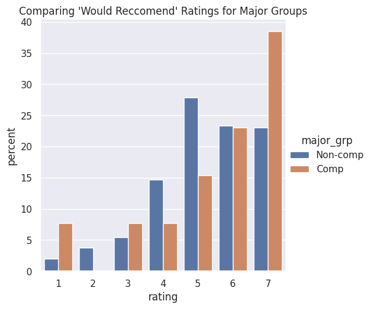
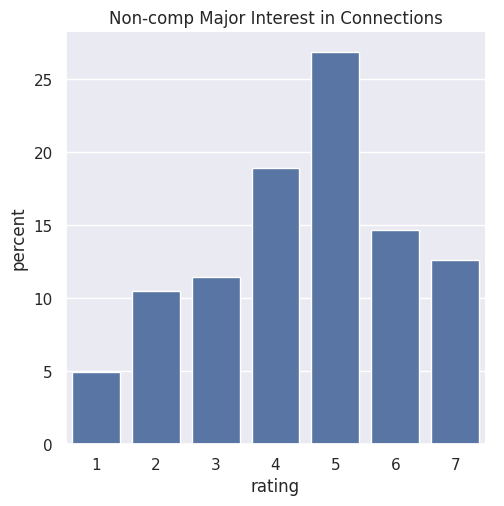

---
# Do not edit the text between these lines!
layout: default
---

# Analysis
The suggestion being analyzed in this project was to include more information about how computer science relates to other fields, in order to make the course seem more interesting and valuable to non-computer science majors taking the course. 

To perform the analysis, first I organized the data by converting the two csv files into one combined, column-based data table. I then limited the columns to only catagories that seemed relevant to the question. The categories I selected were major, interested_connections, interesting, valuable, and would_reccomend.I then separated the data into two column-based tables, one for computer science primary majors and one for studends with a primary major other than computer science. 

First, I analyzed whether the existed any discrepancies between how the two groups viewd the class currently. I got a count of how often each choice (1 - 7, with 1 being strongly disagree and 7 being strongly agree) was selected by the two groups for the interesting, valuable, and would recommend categories. Since there are differing totals between the two groups, there were significantly more non-computer science major responses. Therefore, I converted the data into percentages instead, which also allowed me to get the percentage of respondants in each group that generally agreed with the statement, which I defined as a response > 4. I also used that data to produce bar graphs to visually represent the differences between computer science majors and non-computer science majors in their responses, which are shown below.

img src="<custom-path>/static/imgs/logo.png" alt="Image of Comp110 rainbow logo. "  width="500"/
Based on these graphs, it seems that COMP majors are more likley to be intereseted in this course and think it is valuable, especially when comparing the extremens (1 and 7). The data is slighlty less clear for would_recommend, with many more comp majors responding 7 than non-comp majors, but also more comp majors responding 1 than non-comp majors.

Then, I analyzed whether including information about computer science's connections to other fields would be a possibility to reduce the disparites that I found in the other categories. I used a similar strategy, finding the counts and then percentages of how frequently each response choice was selected by non-computer science majors. I then used the agree function once again to find the percentage of respondants > 4 and created a visual representation of the categorical data using a bar graph. The graph is shown below and the data is included in the conclusion discussion.

This data showed that most non-comp majors are interested in the connections between computer science and other fields, showing that this could potentially be a helpful addition to future versions of this class.

# Conclusion

Future versions of COMP 110 should include information and/or lessons about how computer science relates to or is relavent to other fields to make it more engaging for non-comp majors. Analysis of the survey data supports this suggestion. 

Firstly, a vast majority of the class is composed of students with something other than computer science as their primary major (751) as compared to students whose primary major is computer science (13), highlighting the importance of making the class feel applicable for those non-comp majors. Data about current outlooks of the class, using a 1 to 7 ranking system with 1 representing strongly disagree and 7 representing strongly agree, show that there are current disparities in the perceptions of COMP 110 among non-computer science majors and computer science majors. Computer science majors are more likley to agree that the class is interesting (84.62% responded > 4) compared to non-computer science majors (59.12% responded > 4) and that the class is valuable to them (92.31% > 4 and 68.58% > 4, respectivley). Both groups responded similarly about whether they would recommed the class, with 76.92% of computer science majors saying they would and 74.17% of non-computer science majors responding the same. However, computer science majors wer more likley to strongly agree they would recommend the class, giving a response of 7, than non-computer science majors, 34.46% and 23.04% respectivley. Together, these data show that, overall, computer science majors are more likley to have a postive outlook on the class, seeing it as something interesting, worthwile, and releavant. 

The data also supports, although only slightly, that increasing information about connections with other fields could be a potential way to lessen this discrepency, with 54.19% of non-computer science majors responding that are interested in the connections between computer science and other fields (response > 4). 

An additional refinment that this data could benefit from would be a greater sample size. Since so few students currently enrolled in the course are computer science majors primarily, the sample size for the comp major data was only 13 students, which is not enough to draw significiant conclusions. Therefore, the survey could be repeated across several semesters or years to accumulate more data so more conclusive results could be reached. Further, a follow up survey about the specifics of students' interests, in order to narrow down the connections to what other fields that students are most interested in, and in what specific ways they'd like to learn about these connections.

A potential trade-off or downside of adopting this idea is that COMP 110 is already full of important and complicated information for people learing to code for the first time. Adding lessons into the curriculum might innundate the course with too much information in too short of a time, making it more confusing or too fast paced. Additionaly, lessons related to how computer science interacts with other fields might detract from the main purpose of the course, providing an introduction to programming and the essential foundational concepts of computer science. Therefore, these lessons might be better suited for another course that focuses more on the interdisciplinary nature of computer science.